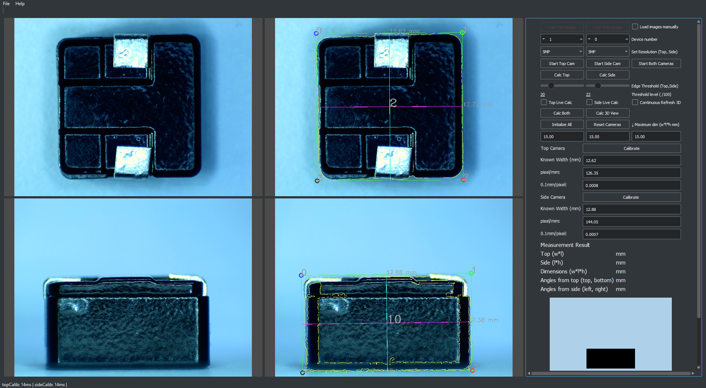
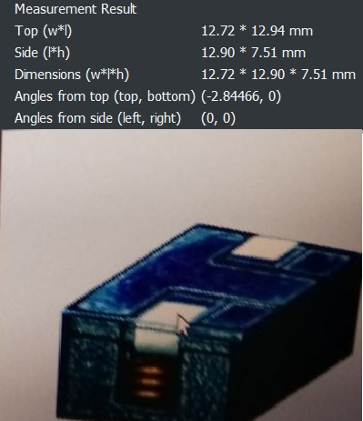
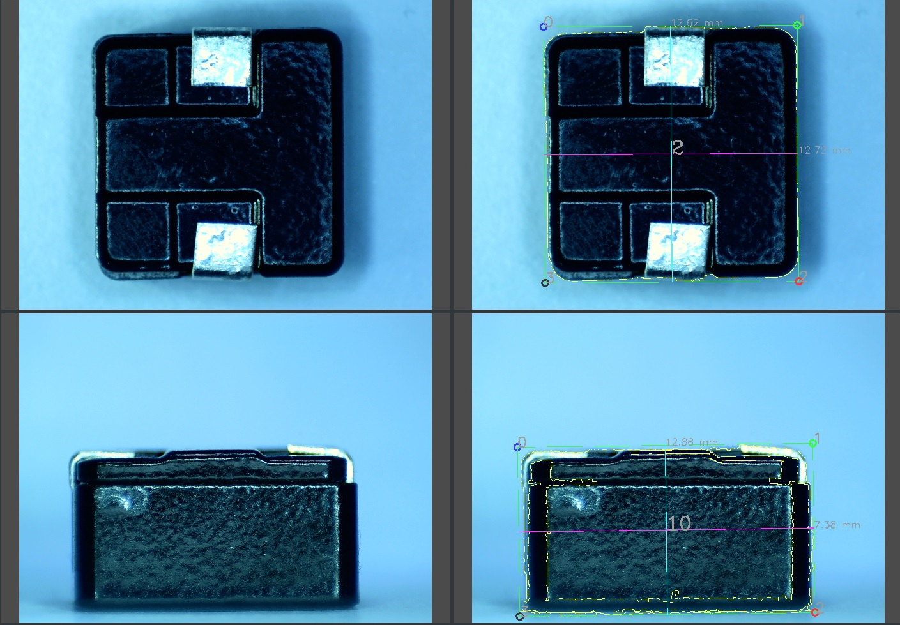
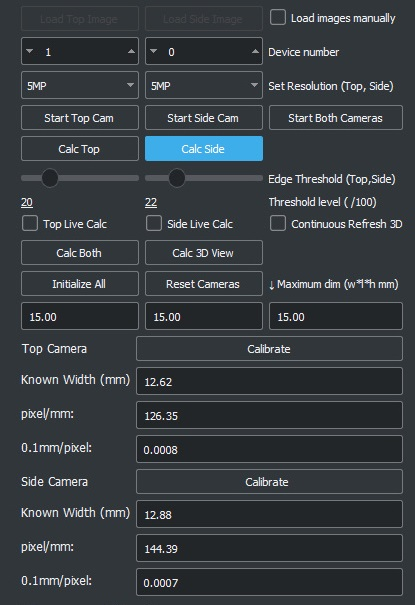

:sectnums:

=== MainWindow (_mainwindow.cpp, mainwindow.h, mainwindow.ui_ )

[[refer-functions-above]]
==== Functions and Members

===== Global Functions
[cols="1,1,5 "]
|===
|void|delay()| Delay the execution for next line for 1 second without causing whole program to hang.
|void| delay(float t)| Delay like delay() but for t milliseconds

|===
===== Public Functions
[cols="1,1,5"]
|===
||explicit MainWindow(QWidget *parent = 0)| Constructor
||~MainWindow()|Destructor 

|===

===== Private Functions
[cols="1,1,5"]
|===

|void|updateStatusBar() |Update the status bar string and the GUI.
|void |setCurrentGlWidget() |Set current GL widget -- hacked from Qt Textures example.

|===

===== Protected members
[cols="1,1,5"]
|===

|void|timerEvent(QTimerEvent *event)|timerEvent callback, used to update camera video stream view and update new images

|===

===== Private members
[cols="1,1,5"]
|===
|Ui::MainWindow |*ui|Pointer to access GUI elements.
|cv::VideoCapture | topCapture_| Access camera images, for top camera.
|cv::VideoCapture | sideCapture_| Access camera images, for side camera

|cv::Mat | topSrc_| Used to store latest top camera image for image processing
|cv::Mat | sideSrc_|Used to store latest side camera image for image processing

|cv::Mat | roiTop_|Used to store top image texture for 3D visualization cuboid.
|cv::Mat | roiSide_|Used to store side image texture for 3D visualization cuboid.

|bool |mFlipVert|Flag to flip image, left unused
|bool |mFlipHoriz| Flag to flip image, left unusued

|bool |manualLoadMode_| Flag to enable manual images loading.
|QString |statusString_| status string for statusbar
|QString |statusStringOld_| old status string for checking whether statusString_ need updating

|QString |topStatus_| status string for top camera
|QString |sideStatus_| status string for side camera

|MeasureThread |topMeasureThread_| MeasureThread for top camera
|MeasureThread |sideMeasureThread_| MeasureThread for side camera
|bool |show3DView_| Flag for continous 3D view

|int |topCameraTimer_       |id for QTimer to update top camera
|int |topCameraId_          |Device ID for top camera, used with cv::VideoCapture
|double |topCalibWidth_     |Known width for top calibration
|double |topPixelPerMetric_ |Calculated pixel/mm (or manually input by user)
|bool |isLiveTop_           |Flag for continous top camera measurement

|int |sideCameraTimer_       |id for QTimer to update side camera  
|int |sideCameraId_          |Device ID for side camera, used with cv::VideoCapture
|double |sideCalibWidth_     |Known width for sidecalibration
|double |sidePixelPerMetric_ |Calculated side camera pixel/mm (or manually input by user)
|bool |isLiveSide_           |Flag for continous top camera measurement

|double |width_  |buffer used to store width
|double |height_ |buffer used to store height
|double |length_ |buffer used to store length

|double |maxWidth_ |Maximum dim, width
|double |maxHeight_|Maximum dim, height
|double |maxLength_|Maximum dim, length

|QString |topFilename_ |Used to load top images manually
|QString |sideFilename_|Used to load side images manually

|enum |{ NumRows = 2, NumColumns = 2 }| For 3D widget view, hacked from Qt Textures example 

    |GLWidget|*glWidgets[NumRows][NumColumns]; |For 3D widget view, hacked from Qt Textures example 
    |GLWidget |*currentGlWidget;|For 3D widget view, hacked from Qt Textures example 
|===

===== Signals
[cols="1,1,5"]
|===

|void |requestTopCalibration(cv::Mat src, double knownWidth)
|Send latest top cv::Mat and known width to request top calibration.

|void|requestTopMeasurement(cv::Mat src, double ppm, bool giveROI, double maxWidth, double maxHeight);
|Send latest top cv::Mat, knwon pixel/mm, flag to receive ROI, maximum width and maximum height to request top measurement
|void |requestSideCalibration(cv::Mat src, double knownWidth)
|see above, but for side calibration
|void |requestSideMeasurement(cv::Mat src, double ppm, bool giveROI, double maxWidth, double maxHeight)
|see above, but for side measurement.

|void |setCurrentGlWidget() | set 
|void |rotateOneStep();

|===

===== Slots
[cols="1,1,5"]
|===
|void |on_enable3D_toggled(bool checked)|Checkbox to enable continous 3D.

|void |on_calcBothButton_clicked()|Triggers Top Calc, then Side Calc.

|void |on_calc3DButton_clicked()|Load textures to 3D visualization cuboid.

|void |on_initAllButton_clicked()|initialize both cameras, calibrate, measure once.

|void |on_startBothButton_clicked()|Shortcut to initialize both caemras

|void |on_actionExit_triggered()| Menubar action exit.

|void |on_actionAbout_triggered()|Menubar action showing about Dialog.

|void |on_loadTopButton_clicked()|Load top image.

|void |on_loadSideButton_clicked()|Load side image.

|void |on_enableLoadImage_clicked(bool checked)| Chewckbox to enable GUI elements for loading images manually.
|void| on_updateTopCalibration(cv::Mat dst,double newPpm, int el)| Update GUI after received top calibration results.
|void| on_updateTopMeasurement(cv::Mat dst,double width, double height, int el, double angle1, double angle2)
| Update GUI after received top measurement results.
    
|void| on_updateSideCalibration(cv::Mat dst,double newPpm, int el) | Update GUI after received side calibration results.
|void| on_updateSideMeasurement(cv::Mat dst,double width, double height, int el, double angle1, double angle2)
| Update GUI after received side measurement results.

|void| on_startTopButton_clicked()|Start top camera video stream.
|void| on_startSideButton_clicked()|Start side camera video stream.

|void| on_calcTopButton_clicked()  |Send signal to request top measurement.
|void| on_calcSideButton_clicked()|Send signal to request side measurement.

|void| on_sideCalibButton_clicked()|Send signal to request top calibration.
|void| on_topCalibButton_clicked()|Send signal to request side calibration

|void| on_resetButton_clicked()|Close camera video streams.

|void| on_enableLiveTop_toggled(bool checked)|Checkbox to enable live top measurement flag.

|void| on_enableLiveSide_toggled(bool checked)|Checkbox to enable live side measurement flag.

|void| on_updateROITop(cv::Mat roi, float angle1, float angle2) |Receives top ROI, and metal strips angles, update GUI.
|void| on_updateROISide(cv::Mat roi, float angle1, float angle2)|Receives side ROI, and metal strips angles, update GUI.
|===
==== Detailed Description
This is the main widget of the program.
It is made and edited using QtCreator GUI designer.
After each _mainwindow.ui_ edits, QtCreator automatically generates _ui_mainwindow.h_, which contains code related to Signal and Slots made using the GUI designer.
Figure <> shows the GUI in the running program.

Inherits: QWindow

This widget holds two `*MeasureThread*` member objects, ``**topMeasureThread_**`` and `*sideMeasureThread_*`. It connects to these objects using Qt Signal and Slots. While it is said that using Signal and Slots has some resource overhead (http://stackoverflow.com/questions/10838013/does-large-use-of-Signals-and-Slots-affect-application-performance[link]), whether it really has significant impact in this program has not been proven yet.

This widget also holds two `*cv::VideoCapture*` members, `*topCapture_*` and `*sideCapture_*`. These will connect to active cameras and capture current images for this widget's `*topMeasureThread_*` and `*sideMeasureThread_*`  to conduct measurement.

User can also load images manually within the GUI. User has to check "Load images manually" checkbox at top right to enable the buttons to load images.

The following figure illustrates the Signal and Slots connection between `*MainWindow*` and its `*MeasureThread*`(s), for Signals and Slots related to measurements and calibrations (Not all Signal and Slots connections are shown here).

include::Signal-diagram.adoc[]

===== The GUI

Figure <> shows the window of the whole program with its GUI.

[[img-mainwindow1]]

//caption="{counter:refnum}image::images/Image-231116-100704.620.png[]"

[[img-guipanel]]
image::images/ui-labeled.jpg[ title="GUI panel for user"]

Figure <> shows the GUI panel for the user:

. Button and checkbox for loading image manually
* This will disables GUI elements 2. 
. Device number drop-down
* Selects device number for starting the camera. The default usually works, else number between top and side or increase number count by one (if using laptop -- since it has webcam).
. Resolution select
* Chose from preset values (5MP,3MP,2MP,1MP)
. Start cameras button
* Initialize cameras, upon clicking camera video stream wil show as shown in Figure <>
. Calc Button
* Start measurement. First button for top camera, second for side camera
. Edge Threshold sliders
* Set the threshold values for Canny edge detection used by the `*MeasureThread*`(s)
. Calc Both and Calc 3D
* Calc Both button is similar to clicking Calc Top, then Calc Side. Calc 3D loads texture to the 3D view.
. Continous/Live checkboxes
* Basically auto-trigger the Calc buttons every camera stream update.
. Initialize All and Reset Cameras
* Initialize All button runs calibrations of top and side cameras, then run measurement for top and side cameras. Reset Cameras button closes both of the cameras' video stream.
. Maximum dimension values
* When measurement result shows values exceeding maximum values, a warning notifications will show in the camera view.
. Calibration panel
* User is required to input known (horizontal left-to-right) width of the first object to be measured. Then after the Calibrate button is clicked, the new pixel/mm value is calculated. User can also input known pixel/mm value into the text field to skip calibration.

[[img-result-view]]

Figure <> shows the GUI panel for the user. Here, MainWindow shows:

. 2D Dimensions from top camera and side camera.
. 3D dimensions by combining both 2D dimensions (lenght value is taken from most recent measurement from either top or side camera)
. Angles values for metal strip. Angle measured with x-axis to the right equals 0 degrees, and angle increases counter-clockwise but negatively.
. 3D visualzation, textures are from Region-of-Interest (ROI) found with Canny edge detection used during measurement by the `*MeasureThread*`(s). User can use mouse-drag to rotate the view around.

[[img-camera-view]]

Shown in Figure <> is the views for camera. On the left column, the live camera streams of top camera and side camera are shown. In right column, the measurements images with annotations are shown, after user ran measurements or calibrations.

////
[[img-guipanel]

//[#img-window1,title='{listing-caption} {counter:refnum}. The MainWindow, overall GUI']

////

===== Basic Procedure to use the program.

. Place object to be measured in the workstation, inside field of view of both cameras.
. Click **Start Top Cam** button, then **Start Side Cam** button to initiliaze the camera video streams (You may need to adjust the Device Number value if the first try did not work). Check the camera view in the left column. You may need to adjust the object's position and camera lens focus until the view is good enough. 
. Calibrate the pixel/mm value by inputting the value in Known Width (mm) fields for both the cameras and press Calibrate Button. You may do this multiple times, adjusting Edge Threshold slider before each calibration, so that the program detects the object's edges accurately.
. You can swap with other objects after calibrating, or continue using the same object.
. Press *Calc Top* button, then *Calc Side* button. After a moment the result  is shown in the right column view, with some annotations showing detection borders, corner numbers, width, length, etc. Check the measurements result at the right.
. Press *Calc 3D* button. The 3D view at the bottm right should load a new 3D visualization cuboid of the object (with only front and right textures). Use mouse-drag to rotate around the view.
. You can use "Live" mode -- Check the checkboxes for *Top Live Calc*, *Side Live Calc*, and the program will auto-trigger the *Calc Top* and *Calc Side* buttons.
. Enter desired amount of *Maximum dim* values, the right column image view will display warning notifcation if the object measured exceed the maximum dimensions.
. Using *Continous 3D Refresh* checkbox is not recommended as it greatly slows down the program, loading large ROI of the images as texture to the 3D visualization cuboid.
. You can try using the shortcuts such as *Calc Both* button, *Initialize All* button and *Reset Cameras* button for faster operations of the program.

==== Source code explanation

Since this class is made with QtCreator and QtCreator's Designer, some functions are defined inside the Designer, and auto-generated the `*ui_mainwindow.h*` in the build directory.

[quote]
____
Most of the functions in this class are Qt Slots functions, which are basically callbacks. The code is self-explanatory, hence it is not documented in-depth here, user is advised to just run through reading each functions' code.
____
In `*mainwindow.h*`, the includes, class members, functions, Signals, Slots, etc are defined.
The includes are defined at top of the file.

Note that using `*using namespace cv;*` is not used for shortcut to omit `*cv::*`, as it can cause ambigous name problem during compiling under Windows. 

[source,c++]
----
//Qt related
#include <QMainWindow>
#include <QApplication>
#include <QPointer>
#include <QDebug>
#include <QPointer>
#include <QDebug>
#include <QString>
#include <QTime>

//OpenCV 
#include <opencv2/opencv.hpp> 

//For array manipulation
#include <iomanip> 
#include <algorithm>
#include <iterator>
#include <vector>

// QtOpenGL-based widget that support viewing cv::Mat
#include <cvimagewidget.h>

// the MeasureTHreaad
#include "measurethread.h"
----

Constants are declared afterwards.
These constant are related to resoultion of the camera video stream. Some constants are left for experiments and unused, like `*P_W*` and `*P_H*`.

[source,c++]
----
#define  P_W 320 //preview resolution, currently unused
#define  P_H 240

// ~83.8 ppm at 3 MP
// ~110 ppm at 5 MP
#define  C5MP_W 2592
#define  C5MP_H 1944

#define  C3MP_W 2048
#define  C3MP_H 1536

#define  C2MP_W 1920
#define  C2MP_H 1080

#define  C1MP_W 1600
#define  C1MP_H 1200
----

After that,  class members, functions, Signals, Slots, are defined. Some of them will be explained later in next sections.

In `*mainwindow.cpp*`, class functions written. The functions descriptions are as described earlier in sub-sections before ( <<refer-functions-above>> ). Refer to the source code and its comments to understand in-depth.

